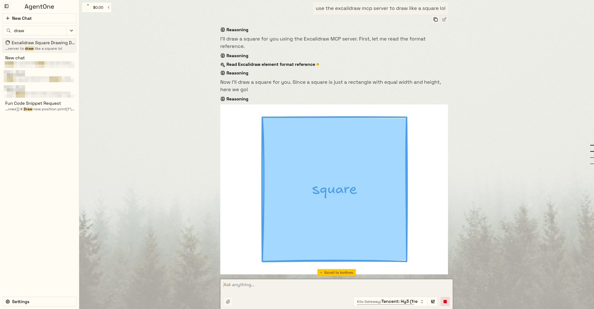
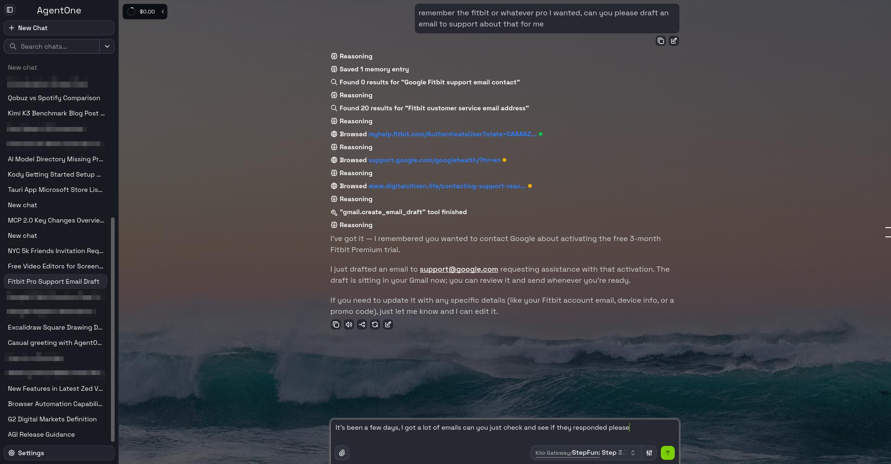
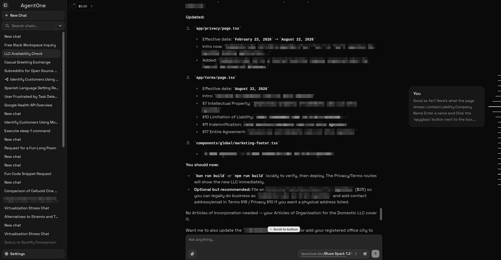

<p align="center">
  
</p>

<h1 align="center">AgentOne</h1>

<p align="center">
  <strong>A free AI agent and deep-researcher.</strong><br />
  Built from the ground up to be fast, performant, and extensible.
</p>

<p align="center">
  <a href="https://www.agent-one.dev">Website</a> ·
  <a href="https://docs.agent-one.dev">Docs</a> ·
  <a href="https://blog.agent-one.dev">Blog</a> ·
  <a href="https://forum.agent-one.dev">Forum</a> ·
  <a href="https://www.agent-one.dev/discord">Discord</a> ·
  <a href="https://models.agent-one.dev">AI Model Directory</a>
</p>

<p align="center">
  
  
  
  
</p>

---

## What is AgentOne?

Most AI tools are either too simple (a chatbot) or too specialized (they only work for one task). **AgentOne unifies all of your tools and does the work**, from first step to finished result.

AgentOne is special because it has one place to browser and connect with over **20,000+ extensions** (apps, services, websites, etc.). Under the hood, this uses **MCP servers**. Right now, `Settings > Extensions` is a UI browser for the official MCP registry, making it easy to discover and connect to anything. I'm building a proprietary registry to provide a richer experience (similar to the Chrome Web Store), which is currently in [private beta](https://www.agent-one.dev/discord). Support for MCP Apps is also in beta.

AgentOne also supports over **10,000+ AI models** from 70+ built-in providers, powered by the [AI Model Directory](https://models.agent-one.dev). Because the AI Model Directory is automatically updated every 24 hours, you don't have to wait for AgentOne to support a new model - it's designed to work out of the box, as soon as it becomes available, without any updates made on our end. Additionally, you can add as many OpenAI-compatible providers as you like.

Unlike many other open-source agents, we offer a [free plan](https://www.agent-one.dev/pricing), so you can try AgentOne easily without spending any money or needing to get an API key. Signed-in users also get features like setting synchronization and our smart router API (closed-source) which ensures high uptimes. Of course, you can use AgentOne without an account too.

Importantly, AgentOne is a desktop app. There are currently no plans for a CLI. I may add a mobile app in the future. The app is built on [Tauri](https://tauri.app), so it's lightweight and runs on Windows, macOS, and Linux.

<details>
<summary><h2>Screenshots</h2></summary>

Here's some screenshots of various AgentOne setups and themes.

**No border radius, yellow theme, forest background image, light mode. Using the Excalidraw MCP app to draw a square:**



**Default roundness setting, lime green colors, custom ocean background in dark mode. Sending an email with Gmail:**



**Default preset dark theme, AgentOne researching LLC laws and editing a codebase based on the findings:**



</details>

## Key Features

- **Subagents:** Obviously. Everyone supports these. Async subagents are coming soon, though!
- **Extensions & MCP:** AgentOne ships with **20,000+ built-in extensions** and supports the [Model Context Protocol (MCP)](https://modelcontextprotocol.io) for custom servers, both local (STDIO) and remote (HTTP). Extensions can also render interactive apps directly inside your chats (MCP Apps, beta).
- **Bring your own key:** Use your own API keys from OpenRouter, Groq, Google, Cerebras, and dozens more directly from your device, with no price markup. Or let AgentOne handle the models for you. Local models via Ollama and LM Studio are supported too.
- **Private by default:** Everything runs locally on your device.
- **Cross-device sync:** Sign in to sync your settings across devices.
- **Per-chat model configuration:** Adjust the model configuration used for each chat, including temperature, top-p, and other parameters. Turn YOLO mode on for one chat, leave it off for another.
- **Multi-chat:** You should be able to have as many chats running simultaneously as you want. We support this fully, including easily switching models in each chat or in the middle of a session.
- **Localized:** Localized into multiple languages, including English, Spanish, French, German, Italian, and Russian.

## Tech Stack

- **Frontend:** React 19, TypeScript, Tailwind CSS v4, Vite
- **Desktop shell:** [Tauri 2](https://tauri.app) (Rust)
- **AI:** Vercel AI SDK with providers for OpenAI, Anthropic, Google, Mistral, Groq, xAI, and 50+ more
- **MCP:** [rmcp](https://github.com/modelcontextprotocol/rust-sdk) (Rust) and the AI SDK MCP client
- **Data:** SQLite via Tauri SQL plugin and SQLx
- **UI:** shadcn/ui + Radix, CodeMirror, Shiki, Tabler icons

## Getting Started

### Download the app

Head to [www.agent-one.dev/download](https://www.agent-one.dev/download) to download AgentOne for your platform. No credit card, no sign-up required to download.

### Build from source

(Docs coming soon!)

## Project Structure

```
src/ # React frontend (routes, components, lib, workers)
src-tauri/ # Rust backend (Tauri commands, migrations, capabilities)
src-tauri/migrations # SQLite database migrations
scripts/ # Maintenance and update scripts
tests/ # Test helpers
```

## Contributing

We welcome contributions! Open an issue for bugs and feature requests, or submit a pull request for improvements. For discussion, feedback, and support, join the [community forum](https://forum.agent-one.dev) or our [Discord server](https://www.agent-one.dev/discord).

Before contributing, please read our [development philosophy](PHILOSOPHY.md) and agent guidelines ([AGENTS.md](AGENTS.md)).

## Community

- 🌐 **Website** - [agent-one.dev](https://www.agent-one.dev)
- 📚 **Documentation** - [docs.agent-one.dev](https://docs.agent-one.dev)
- 📰 **Blog** - [blog.agent-one.dev](https://blog.agent-one.dev)
- 💬 **Forum** - [forum.agent-one.dev](https://forum.agent-one.dev)
- 🎮 **Discord** - [agent-one.dev/discord](https://www.agent-one.dev/discord)
- 🗂️ **AI Model Directory** - [models.agent-one.dev](https://models.agent-one.dev)

## License

See the [LICENSE](LICENSE) file for details.
